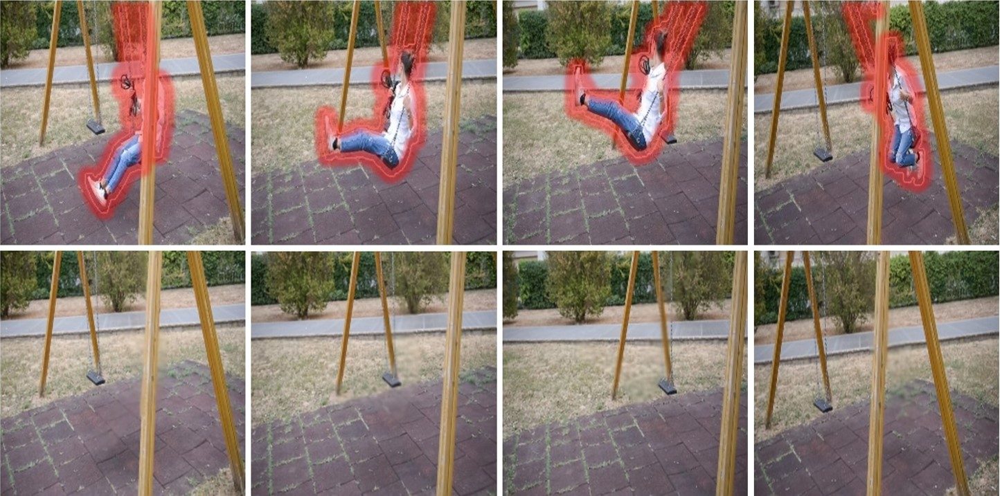
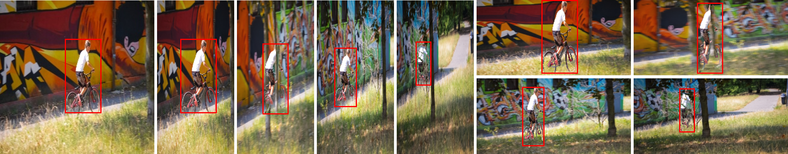

# Deep_Video_Inpainting
Official pytorch implementation for "Deep Video Inpainting" (CVPR 2019)  
[Dahun Kim*](https://mcahny@github.io/), [Sanghyun Woo*](https://sites.google.com/view/sanghyunwoo/), [Joon-Young Lee](https://joonyoung-cv.github.io/), and [In So Kweon](https://rcv.kaist.ac.kr). (*: equal contribution)  
[[Paper](https://arxiv.org/abs/1905.01639)] [[Project page](https://sites.google.com/view/deepvinet/)] [[Video results](https://youtu.be/RtThGNTvkjY)]  

If you are also interested in video caption removal, please check [[Paper](https://arxiv.org/abs/1905.02949)] [[Project page](https://sites.google.com/view/bvdnet/)] 

 
 


## Disclaimer
This is tested under Python 3.6, PyTorch 0.4.0 (dependencies can be compiled on this version).

## Testing
0. Download the trained weight 'save_agg_rec_512.pth' and place it in "./results/vinet_agg_rec/"  
Google drive: [[weight-512x512](https://drive.google.com/file/d/1KAi9oQVBaJU9ytr7dYr2WwEcO5NLiJvo/view?usp=sharing)] [[weight-256x256](https://drive.google.com/file/d/1UCDZVJbymiHUcD2GfLq9-NU65MW6rSY4/view?usp=sharing)]   

1. Compile Resample2d, Correlation dependencies.  
```python
bash ./install.sh
```

2. Run the demo (the results are saved in "./results/vinet_agg_rec/davis_512/").  
```python
python demo_vi.py
```

3. Optional: Run the video retargeting (Section 4.5)
```python
python demo_retarget.py
```
 


## Citation
If you find the codes useful in your research, please cite:  
```bibtex
@inproceedings{kim2019deep,
  title={Deep Video Inpainting},
  author={Kim, Dahun and Woo, Sanghyun and Lee, Joon-Young and So Kweon, In},
  booktitle={Proceedings of the IEEE Conference on Computer Vision and Pattern Recognition},
  pages={5792--5801},
  year={2019}
```


